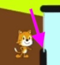

## May 25th

### Bonus Puzzle 

review Bonus puzzle

   

   
#### May 18th Follow the Maze Cake Puzzle Hint
   

   #### May 18th Follow the Maze Cake Puzzle Hint

   What is the little blue line at the edge of the entrance?

   

   

This is what the model project looked like:

 

### Message Mania

Run through the project.

* Design 3 characters. 
  * draw them or describe them in words
* Give each character has a "receive message" block for 3 colors. For example, for character 1 (you don't have to use my example actions!!) I am writing/drawing:
  * red: say my name and introduce myself.   * 
  * orange: move to the edge of the screen and get stuck.
  * yellow: ask a question. What will the question be??
* NO action can be repeated. 

### 3 Little Pigs in ScratchJr
<!-- NOTE fix link to html  -->
[3 Little Pigs in ScratchJr](../lessons/3LittlePigsInScratchJr.md)

Show them the first screen but not actions. Have them recreate the 1st screen.

1. there were three little pigs.
   1. One pig goes to the center and introduces themselves
        1. Draw each pig a little differently
        3. Each pig says something different: name, why my house is good, ?
   2. They become small　   
   3. The pig then goes to their house
   4. They ask/tell the house they are going in　
   5. The house lets them . How would you show that????
   6. The next pig goes and does the same

