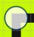

## May 18th

### May 18th: Follow the Maze Project
In this class, we will make 4 controls for one character. Download and see **Screen 2** of the [3-Button-Race and Follow The Maze Sample Projects](./scratchProjects/3ButtonRaceFollowTheMazeHW.sjr). They will make the character move up, down, right, and left. Here is a picture. Can you figure out how it works?

* I made one **Arrow**. Then I copied it and rotated it to make the other 3. Here is the **Left Arrow**:

* Then I added code for each arrow. Here is the code for the **Up Arrow** 
  
  * Arrow: yellow touch trigger, send message
  * Cat: get message, do action

### May 11th Homework: Finish the Follow the Maze

**Screen 2** has 4 Arrow Controls. The **Up Arrow** works like above, but your Homework is to make the other **Arrows** work.

1. Use different color messages
2. Make the controls a little smaller 
3. Change the Maze (in the background)!!
   
   * Use this kind of maze if you want it simple. See the dots in the middle of the squares?

   * **Useful Tip**: When you adjust the dots/lines for your maze, make the dots in the **CENTER** of the light grey grid squares, **NOT on the lines** of the grid squares.

      * YES: {: width="100px"}
      *  No: {: width="100px"}

Now you have a **Follow the Maze Game**! 

Easy Peasy! 

Here is my finished one. It has an extra twist at the end. 

* Can you figure out how the **Cake** appears? *Hint: It uses a hidden control.*

### Today's Project is making a maze with controls.

Brings together all the skills we have.

We will focus especially on improving 2 skills:

- [ ] Using the drawing screen to modify backgrounds and characters
- [ ] Make Controls other characters using messages

## Controls
Watch as I create a control. Can you do it too?

Here a basic step by step;

1. Planning: 
   * What is your story? 
   * Who are your characters
   * What is the maze?
   * What happens in the maze? 
   * What obstacles will you have? 
   * Surprises? 

2. The maze
   * Kinds of mazes
        1. walk on a line maze (project 3)
        2. walk in a path maze (Button Race, screen 2)
        3. 