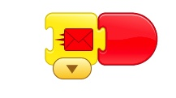

* [April 20th](#april-20th)
  * [Review Sending Messages by Making a Conversation](#review-sending-messages-by-making-a-conversation)
  * [Going to a different Screen](#going-to-a-different-screen)
  * [Continue the conversation](#continue-the-conversation)
  * [Homework](#homework)
  * [Hugh and Akira almost had the Dragon Maze solved.](#hugh-and-akira-almost-had-the-dragon-maze-solved)

# April 20th

## Review Sending Messages by Making a Conversation

* First Fairy Sends the Message

* The Frog receives it and responds

## Going to a different Screen

1. We create a new Screen

2. Go back to 1st Screen
3. The screen appears in the (red) buttons

1. We add it to the actions

## Continue the conversation

1. Drag Characters to new screen from old.
2. Delete default Character
3. Choose background
4. Continue the conversation the same way. 
5. Um Froggie 

1. Yes 

7. Send Red Message

7. This is not a Forest. Send yellow message.

8. Continue sending messages using other colors.

## Homework

The homework was to make a conversation by sending message back and forth between characters. If you need something for the characters to say, [here](../lessons/JokesForBadJokes.md) are some jokes to use.

## Hugh and Akira almost had the Dragon Maze solved.

Hugh and Akira worked very hard on the Dragon Maze, but they had a problem. I have made special [Dragon Maze Part 2](../lessons/DragonMazePart2.md) directions on making the Dragon maze work. The directions are very detailed, so take it slow. If you have questions, we will go over it in class next week. 

