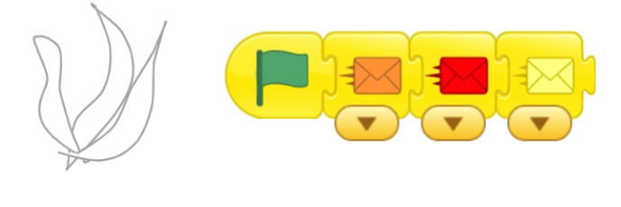
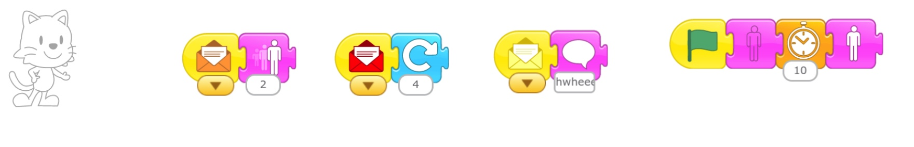

## May 25th

### Message Mania Part 1

We ran through the Message Mania HW assignment.  The purpose of the HW was to:

* Plan/think about the story before you code it. That is why the assignment was NOT to do it in ScratchJr.

My explanation was poor. I blame Zoom ;-) 

Many children did this: 

* One character has: Green flag, orange message, red message, yellow message.

{: height="100px"}

What I wanted was:

* Each character has a green flag. No message. Messages will be sent by Buttons.
* Each character receives 3 messages
* Each reactions is a different type

{: height="100px"}

The purpose of the project was:

* to show that messages can go to more than one character at a time. 
* to continue getting practice coding messages and buttons.
* Clicking a button can make several characters move at once.
* Help some students use Messages instead of Wait buttons to control sequence and timing. 

I will post a samole project here later in the week.

### Message Mania Part 2

Messages can happen one after the other, such as this common code:

* One character has: Green flag, orange message, red message, yellow message.
* Each message go to one character. Tick does the orange. Tac does the red. Cat does the yellow.

Messages also happen like this.

* Every character has their own green flag.
* Messages are sent to more than one character. 
* Message Mania was many of this pattern happening all at the same time. 

I didn't get to explaining this to students (Zoom is tough), but we'll work on it again in person.

* The character gets the message, and sends another color message to a different character.
* That character sends the next message.

### Bonus Puzzle 

review Bonus puzzle

   

   
#### May 18th Follow the Maze Cake Puzzle Hint
   

   #### May 18th Follow the Maze Cake Puzzle Hint

   What is the little blue line at the edge of the entrance?

   

   

This is what the model project looked like:

 

### 3 Little Pigs in ScratchJr
<!-- NOTE fix link to html  -->
[3 Little Pigs in ScratchJr](../lessons/3LittlePigsInScratchJr.md)

Show them the first screen but not actions. Have them recreate the 1st screen.

1. there were three little pigs.
   1. One pig goes to the center and introduces themselves
        1. Draw each pig a little differently
        3. Each pig says something different: name, why my house is good, ?
   2. They become small　   
   3. The pig then goes to their house
   4. They ask/tell the house they are going in　
   5. The house lets them . How would you show that????
   6. The next pig goes and does the same

